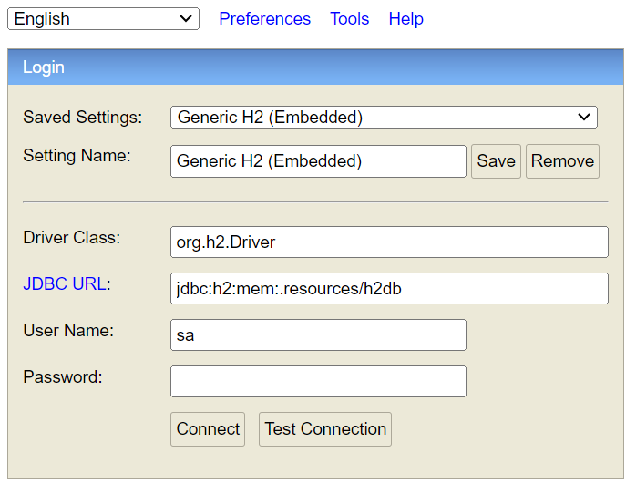

# dhbw-study-smart
DHBW TINF22B4 Software Engineering Project: DHBW Study Smart Webapp

## Table of Contents
- [About](#about)
- [Prerequisites](#-prerequisites)
  - [nvm (Node Version Manager)](#nvm-node-version-manager)
  - [Node.js and npm](#nodejs-and-npm)
  - [Angular CLI](#angular-cli)
  - [H2 Database Console](#h2-database-console)

## About
TBA

## 📝 Prerequisites

### nvm (Node Version Manager)
Install nvm on **unix** or **macOS** systems by following this installation guide: https://github.com/nvm-sh/nvm#installing-and-updating

To install nvm on a **Windows** system download and run the **nvm-setup.exe** from the following: https://github.com/coreybutler/nvm-windows/releases

### Node.js and npm
Install Node.js depending on the supported Node.js version of the current Angular version. For reference see: https://angular.io/guide/versions

Node.js can be installed via the following command and change the version accordingly if needed (npm will be installed automatically with Node.js):
```bash
nvm install 18.18.2
```

Check your installation and version of Node.js and npm with the following commands:
```bash
node -v
```
```bash
npm -v
```

If you have a different Node.js version on your system you can change the used version via the following command (change the version accordingly):
```bash
nvm use 18.18.2
```

### Angular CLI
Install the Angular CLI with the following command:
```bash
npm install -g @angular/cli
```

Check your version of the Angular CLI with the following command:
```bash
ng version
```

### H2 Database Console
Start the Spring Boot Application and check the following localhost.
The port is the same as the port your Spring application is running on.

http://localhost:8080/h2-console

Then you will see the following console


Everything you have to input you can find in the application.properties file from 
the Spring application. At this point in time the following input is correct: 


Driver :    ```org.h2.Driver```

JDBC url:   ```jdbc:h2:mem:.resources/h2db```

User Name:  ```sa```

password:   ```password```
